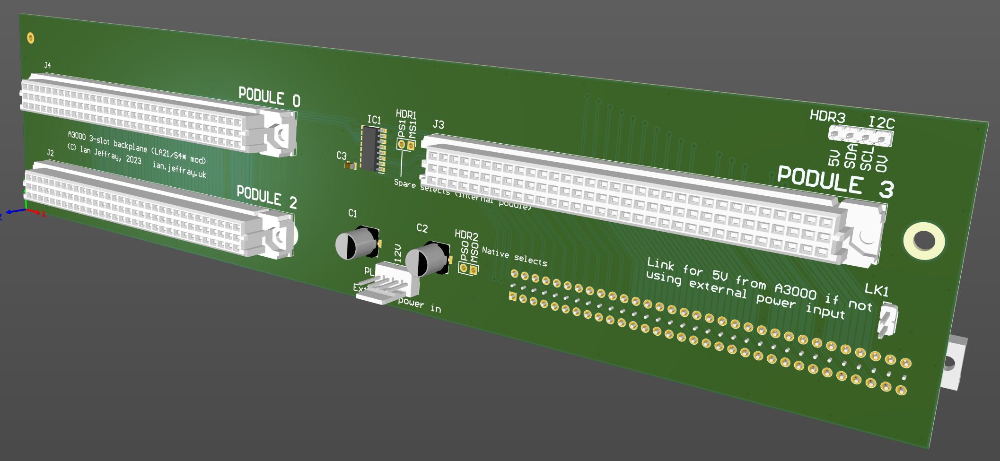

# Acorn A3000 three-slot backplane

November 2023

A three-slot backplane for Acorn A3000 machines.
Designed to mechanically suit the Wild Vision A3000 Podule expansion box - this board relies on the A3000 motherboard having been patched with two wires to bring LA21 and S4* out to previously-unused pins on the external expansion connector.  The backplane then uses these two extra signals to generate new PSx and MSx signals using an onboard HC139, identically to how other backplanes operate.  The A3000 has this function on the motherboard (IC33), but only tracks-out podules 0 and 1 for the single internal and single external podule.

N.B. The A3000 board re-creation by The Board Folk includes new LK96/LK97 options to feed the required signals to the external connector to support this backplane - no mod wires required!

## Licence

No warranty is provided, and this work is used at your own risk.  

Licenced as CC BY-SA 4.0

Copyright 2023 Ian Jeffray

